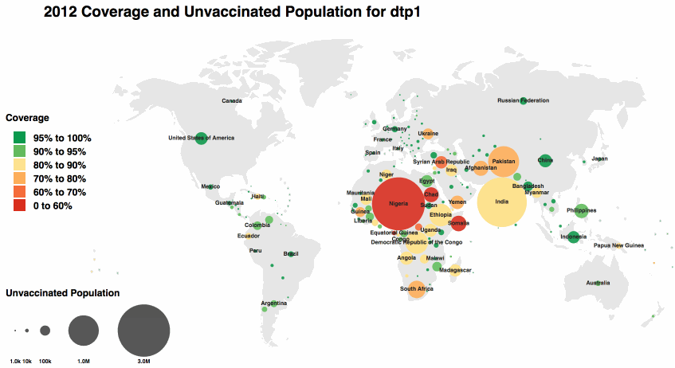
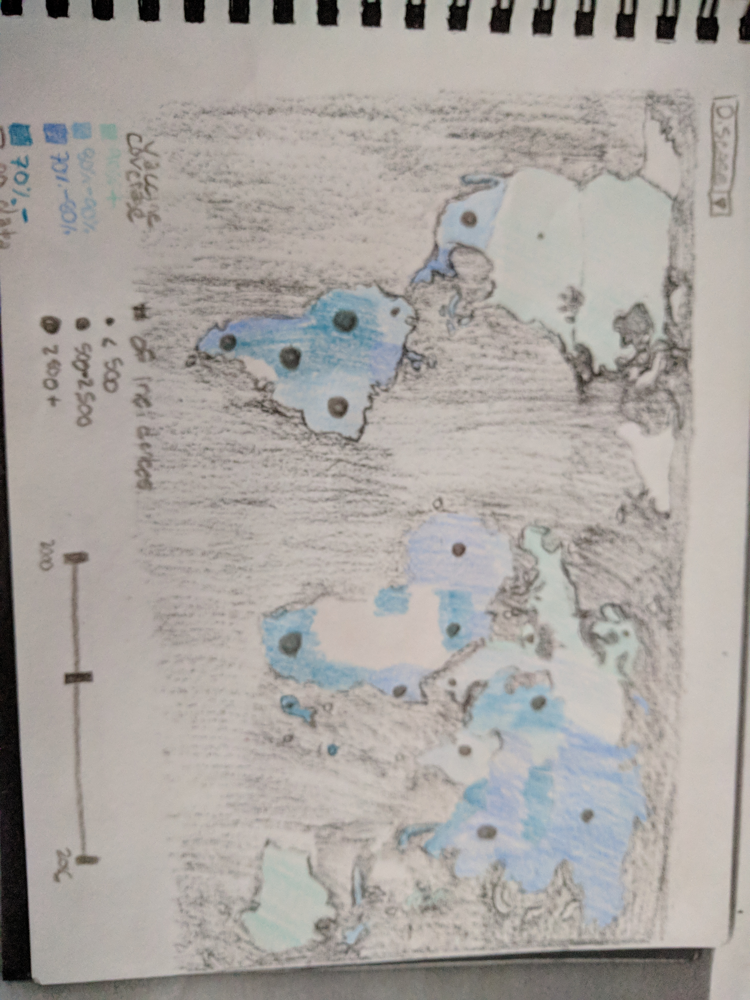
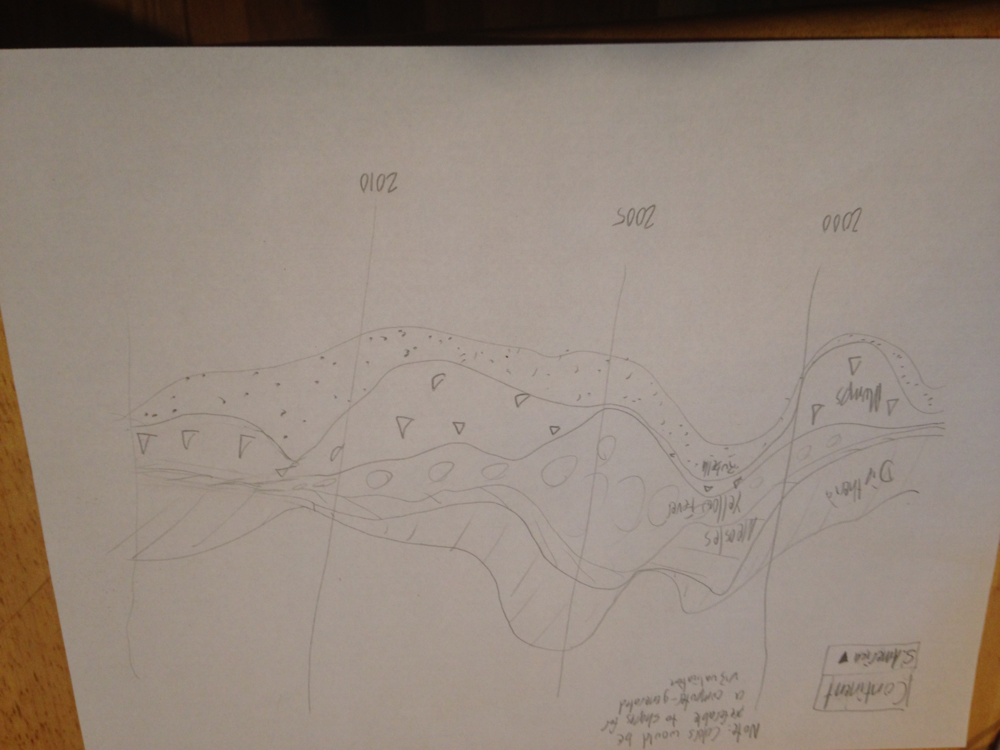
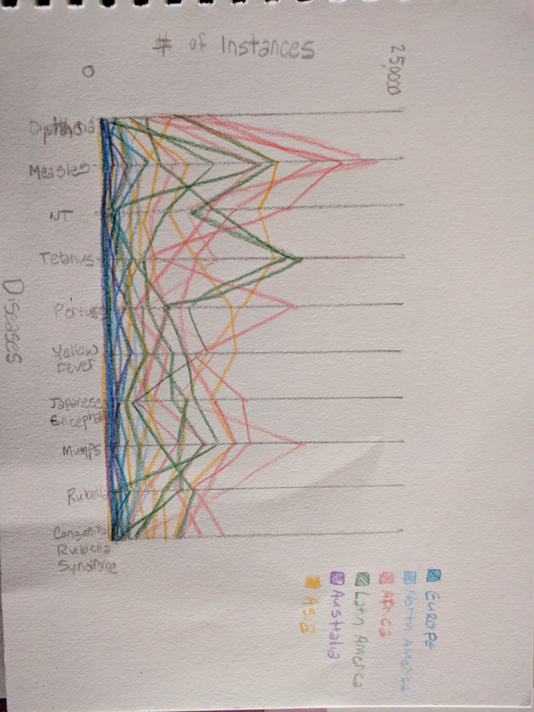
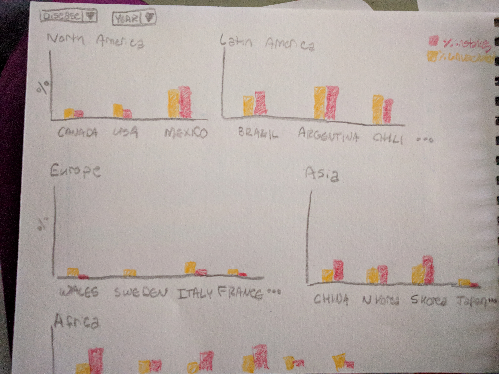
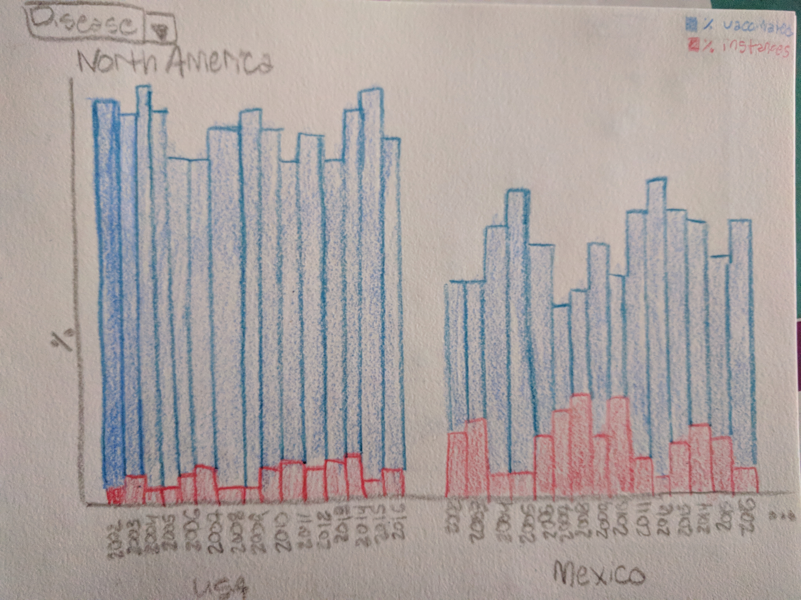
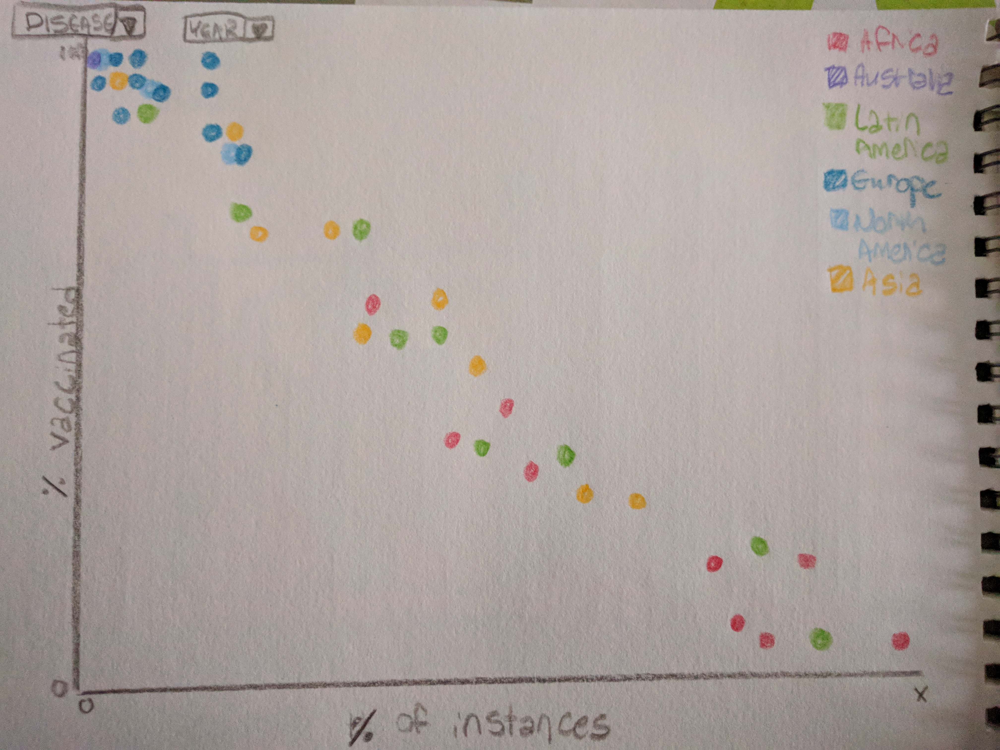
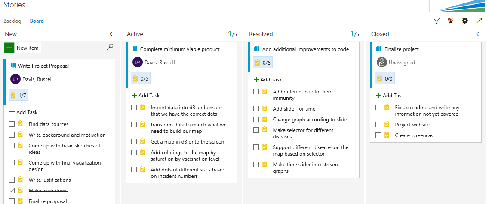

 
Proposal
===

# Visualizing the Global Relationship between Vaccines and Disease Incidence Rate
---
https://github.com/RussBDavis/Data-Vis-Final

Russell Davis (rdavis@wpi.edu Github: russbdavis)

Brittany Gradel (bgradel@wpi.edu Github: bgradel)

ML Tlachac (mltlachac@wpi.edu, Github: mltlachac)

# 1. Background and Motivation

Vaccines have performed amazingly well to prevent the spread of diseases. However, crippling and deadly diseases have become just a memory in countries with easy access to vaccines.  Given the widespread myth that vaccines cause autism, some people in these countries have ceased to vaccinate their children.  The threat of autism is more real to them than the threat of the deadly diseases.  Even in countries where these diseases are prevalent, not everyone is vaccinated due to lack of access or fear that vaccines can cause sterility. This is dangerous to the unvaccinated individuals as well as to the people with preexisting health issues who can not be vaccinated. The people who can not be vaccinated rely on herd immunity, which is when enough of the population are vaccinated to keep the disease from spreading  (http://www.pbs.org/wgbh/nova/body/herd-immunity.html).

As such, it is important for everyone to understand the importance of vaccinating, for themselves and their communities.  While the data exists to support vaccination, this data needs to be displayed in an easily comprehensible manner.  The current visualization for vaccine and disease incidence data are often confusing, dull, and/or underwhelming.  For example, the following visualization from the World Health Organization (WHO),  based on the first two datasets detailed in Section 3, is used to compare percent vaccine coverage and number of instances (http://www.who.int/immunization/monitoring_surveillance/data/en/).  

This visualization is difficult to understand, even for someone well versed in the domain.  Clearly, there is a need for an improved visualization that imparts the importance of vaccination on the audience.   Thus, creating a interactive visualization that is both enticing and understandable is integral to promoting the continuing usage of vaccines.

# 2. Project Objectives

Our objective is to visually compare vaccine coverage with disease incidence rate in a way that is appealing and educational for a general audience.  Specifically, our visualization will use the data detailed in Section 3 to improve upon the visualization introduced in Section 1.  By emphasizing the time-variant impact of vaccines with less distracting visual idioms, we hope to more clearly illuminate their efficacy.  This will be a challenge in constructing a compelling animation that is simple and accessible to the layperson, and we hope that it will serve as a tool to easily communicate the strong statistical support for vaccine usage.

# 3. Data

This project mainly incorporates two different downloadable datasets from WHO: one on vaccines and one on diseases (http://www.who.int/immunization/monitoring_surveillance/data/en/).  The Vaccine dataset contains 8 features and the Disease dataset contains 42 features. Both contain three location variables: name, region, and county. The Vaccine dataset also contains vaccine, year (2000-2016), target population, administered doses, and percent coverage.  There are 49,903 rows in this Vaccine dataset. The Disease dataset also contains the disease and the number of cases for each year between 1980 and 2000.  There are 194 rows for each of the 10 different diseases (though one disease is a subset of another disease).  Both datasets contain many missing values from countries where there is not vaccine rate or disease incidence data available.

We also have two supporting datasets.  The first is downloadable country population data from the World Bank (https://data.worldbank.org/indicator/SP.POP.TOTL).  This dataset contains the country name and code, indicator name and code, and the population for every year between 1960 and 2016 for 264 countries.  Lastly, we also include data from Epidemiological Reviews found in a Nova article (http://www.pbs.org/wgbh/nova/body/herd-immunity.html).  This data required us to manually add it to a useable format, however it only contains 3 features and 7 rows of data.  The features include the disease, the basic reproduction number, and the herd immunity threshold.  

In section 7, we discuss the option of including financial data on vaccines into the visualizations.  This data includes the amount of money each country has spent on vaccines starting in 2014 (http://www.who.int/immunization/programmes_systems/financing/data_indicators/en/)

# 4. Data Processing

Our first data processing step is to combine the data.  The first three datasets detailed in Section 3, they all share a country name that can be used to merge the data.  Specifically, we will be only include data from between 2002 and 2016 in the merged dataset as this is the range of years contained in the Vaccine dataset, which contained the fewest years of data.

Using the population count third dataset, we will also conduct feature engineering by creating a new feature that transforms the disease incidence rate in dataset 2 into the percent of the population who became infected.  This inclusion of the population will yield better results for the geographical visualization, detailed in section 5, as regions with a larger population will not be visually penalized even when they may have a lower disease incidence rate.  It is also more understandable to compare disease incidence rate with the vaccine rate.  
The fourth dataset will be used only in feature engineering and not merged with the other datasets.  This dataset contains the herd immunity threshold.  By comparing this percent with the percent vaccine coverage, we create a binary variable for whether herd immunity was accomplished for each country.

We know of multiple tools that can join the data on the country name feature and are determining the best method.  The feature engineering will all be conducted in Python using Pandas DataFrames.  

As discussed in Section 5, we treat the missing values differently depending on the data.  For instance, one of our proposed visualizations will have a distinct hue for missing data while another one does not include these countries.  For the latter of these problems, we will simply remove the rows of data with missing values in the particular years.  However, for the prior of these problems, we are not yet sure how we will have to process the missing values to achieve the desired results for the visualization. 

# 5. Visualization Design Options

## 5.1 Map options

The advantage overall for using a map is that our data itself is geospatial in nature which means that rather than having to use abstract concepts for location, the location can correspond directly to a location on a map which is a visual idiom for representing locations that most of the general population is familiar with. It also includes a lot of information for the user that might otherwise be lost. For example, many user in the US will not know if we have disease data on Nigeria where exactly Nigeria is or what the rough size of it is. A map provides this information without it having to specifically be written out in text that most users will not read. 

The disadvantage of using a map is that we lose many ways for the users to most accurately perceive differences in the values. For example, unlike with a bar chart we cannot align values to a central axis. One of the most obvious ways of encoding information on a map is using area which is a poor visual encoding for accurate perception. 

Some examples of potential maps can be seen below, one showing incidence rates compared to herd immunity and one showing incidence  rates compared to vaccination rates.

## 5.2 Stream graph

The advantage of a stream graph is that they are very visually dynamic/aesthetically pleasing so they catch the attention of users which aligns with our primary goal of spreading vaccine awareness. They are also good at encoding multiple views of time information at once, so they do a good job of illustrating the growth and spread of diseases over time. 

The main disadvantages of a streamgraph is that they are incredibly difficult to get accurate comparisons out of or to get more specific information other than general trends over time.  They can also be confusing to many users who aren’t familiar with them or who are looking for more exact axis information.

## 5.3 Parallel Line Chart

Parallel Line Charts  provide an excellent counterpoint to stream graphs.  They are not particularly accessible to those with limited visual literacy, but they provide an easy way of identifying trends, especially when interaction and filtering is involved.  In this case, as a complement for stream graph, it would enable for an easy quantitative analysis after identifying interesting trends.

## 5.4 Bar Charts

The advantage of bar charts is that they they are very good for accurate perception between values. The disadvantages is that they aren’t good at illustrating trends over time and they can’t encode as much information into the same graph and still be readable. That means creating many separate bar charts to encode the necessary information.  For instance, there would have to be a bar chart for each continent.  Each country in that content has a series of bars.  In the first option, the bars for each country include the percent of unvaccinated population and the percent of the population infected.  In the second option, there is a stacked bar for every year in the dataset, where the stacked bar includes both the percent of the vaccinated population and the percent of the population infected.

## 5.5 Scatterplots

Scatterplots are able to somewhat accurately depict the dataset but their main disadvantage is that they aren’t good at showing trends or changes in large data sets.  Because of our many dimensions, a SPLOM or something similar with high space consumption and low readability would be required to adequately show all the relevant details.  In particular, scatterplots ignore the geographical component to the dataset.  However, the scatterplot below demonstrates the trend between the vaccinations and percent of the population infected.  

# 6. Final Visualization Design

Our final design is a map based design that uses saturation for the severity of the lack of vaccination with a separate hue to categorically define places where herd immunity standards have been achieved. There will be dots of increasing sizes to represent the number of incidents in those areas. We would also like to utilize the strengths of the parallel line chart by adding a temporal element to our chart in the form of a slider on the bottom of the map that allows the user to click and drag to various points in time. 

Ultimately, because we are using our design to raise awareness and help lay people understand the problem, we do not believe it is necessary for our target users to be able to make very accurate comparisons between values, however, it is important for them to easily understand the big picture even if they are not very well trained in viewing and consuming visualizations.

# 7. Must-Have Features

For minimum features we must have a map for one moment in time for a single disease which displays both vaccination rates and incidence rates for that disease.  This would be comparable to a snapshot from the first image cited from the WHO; however, it will be created using the techniques specified above for better use and readability.

# 8. Optional Features

Optionally, we would like to have a selector where we can view any disease, and possibly a view for totals for diseases overall.

We would also like to have a sliding bar for the year. As an extra optional step we could possibly make the year slider a streamgraph that would show the diseases at that time.

# 9. Project Schedule

Our project plan is encapsulated currently in our visual studio team services project where I have listed out in the below image.  
The task list for the proposal is listed for posterity.  Because there are only 12 days before the submission deadline,
we propose to complete the MVP in the first week and spend the second week adding the additional features as possible while
generating the requisite video and preparing the project for submission.

If you would like to be added as a reader to our repository for more details, please message Brittany on slack or e-mail her.

