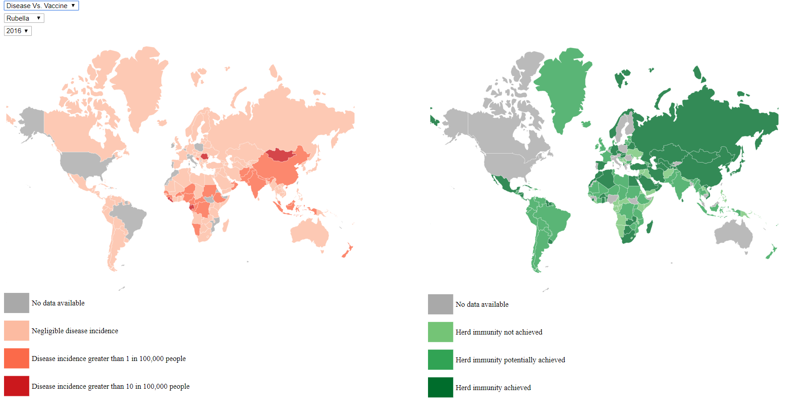

# Overview

The main goal of this assignment is to educate people on the importance and efficacy of vaccines in reducing disease rates. We accomplished this by making a two maps one for showing disease prevalence and one for showing either vaccine percentage or the prevalence of a disease of a different type or time depending on what mode is selected. Disease maps are shown in red because it is a threatening color, where vaccine maps are shown in green. Tooltips give additional information to aid understanding and show particular values.

# Github Pages

https://russbdavis.github.io/Data-Vis-Final/

Additionally, the repo where our work was conducted can be found at https://github.com/RussBDavis/Data-Vis-Final.

# Screen-shots

# Process Book

Our process book can be found at: 

[Process Book](ProcessBook/ProcessBook.md).

# Video

A video detailing the intended use of our visualization can be found at:

https://youtu.be/HjUolx54Beo. 

The rough draft of the script for this video can be found at:

[Video Script](Script.pdf).

# Data

The data used to construct this visualization was found at:

http://www.who.int/immunization/monitoring_surveillance/data/en/

https://data.worldbank.org/indicator/SP.POP.TOTL

We also have our own version of the raw data in the "RawDataSources" folder of this project, as well as the modified sheets we used within the "WorldMapPopCode" folder

# Resources

http://bl.ocks.org/micahstubbs/8e15870eb432a21f0bc4d3d527b2d14f
http://bl.ocks.org/jfreels/6734823
https://www.w3schools.com/tags/tag_select.asp
https://www.daniweb.com/programming/web-development/threads/490815/how-do-i-insert-a-html-file-into-another-html-file
https://bl.ocks.org/jkeohan/b8a3a9510036e40d3a4e
https://bost.ocks.org/mike/map/

In addition we all reference previous assignments we had done from this class to leverage previous knowledge.

